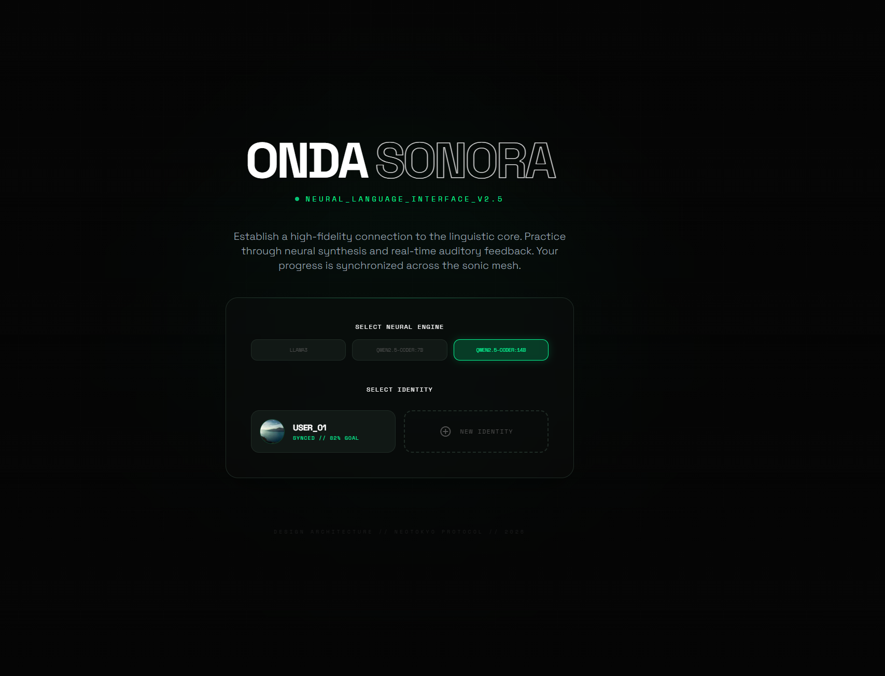
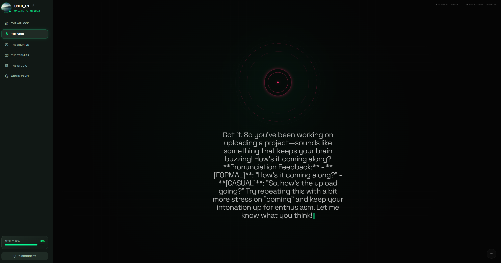
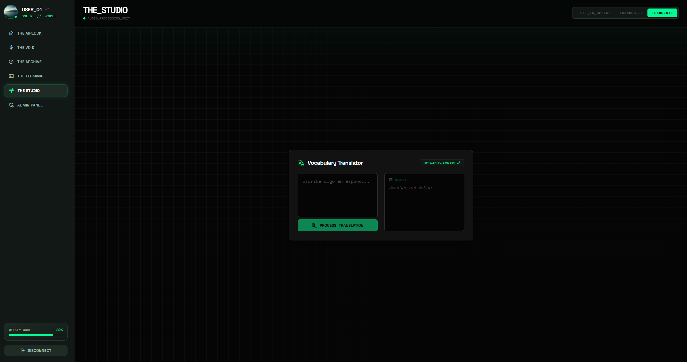
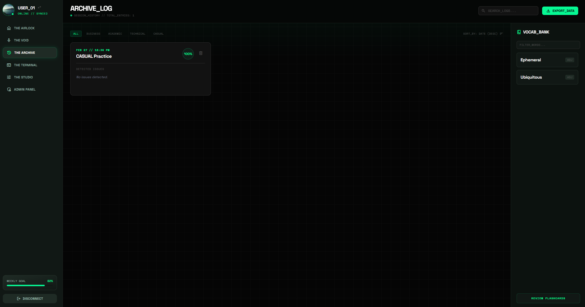

# 🌊 Onda Sonora

<div align="center">
  
  
  <p align="center">
    
    
    
    
    
    
  </p>

  **Domina un nuevo idioma con el poder de la IA.**
</div>

---

## 📌 Índice

- [🚀 Sobre el Proyecto](#-sobre-el-proyecto)
- [✨ Características Principales](#-características-principales)
- [🛠️ Apartados de la App](#️-apartados-de-la-app)
- [💻 Ejecución en Local](#-ejecución-en-local)
    - [📋 Requisitos Previos](#-requisitos-previos)
    - [🤖 Configuración de Ollama](#-configuración-de-ollama)
    - [🐧 Instrucciones para Linux](#-instrucciones-para-linux)
    - [🪟 Instrucciones para Windows](#-instrucciones-para-windows)
- [⚙️ Configuración Adicional](#️-configuración-adicional)

---

## 🚀 Sobre el Proyecto

**Onda Sonora** es una plataforma de aprendizaje de idiomas diseñada para ofrecer una experiencia inmersiva y moderna. Combinando un frontend React de alto rendimiento con un backend FastAPI eficiente, permitimos a los usuarios practicar traducción, gestionar su vocabulario y realizar sesiones de práctica en tiempo real potenciadas por **Ollama**.  

Lo que hace único a Onda Sonora es su compromiso con la **libertad de aprendizaje**: aprovechamos modelos **open‑source** ligeros como *llama3*, que se ejecutan directamente en tu computador. Esto significa que puedes entrenar y practicar idiomas de manera **local**, sin depender de créditos, suscripciones ni límites externos. Con esta arquitectura, cada estudiante tiene acceso ilimitado a un entorno de estudio potente y accesible, capaz de funcionar con modelos optimizados para ofrecer una experiencia fluida y sin restricciones.


---

## ✨ Características Principales

*   **Studio Translator**: Traductor bidireccional Inglés-Español integrado.
*   **Gestión de Vocabulario**: Guarda y organiza nuevas palabras descubiertas durante tus sesiones.
*   **Seguimiento de Progreso**: Visualiza tus metas semanales y rachas de aprendizaje.
*   **Interfaz Premium**: Diseño oscuro con efectos de glassmorfismo y animaciones fluidas.

---

## 🛠️ Apartados de la App

> [!TIP]
> **Nota para el desarrollador:** Aquí puedes insertar las capturas de pantalla reales del funcionamiento de la app.

<div align="center">

## 🏠 Inicio
*Pantalla principal de bienvenida y acceso rápido a las funciones.


### 🏠 Dashboard Principal
*Muestra de la vista general del usuario, metas y progreso.*  


### 🎨 Studio & Traductor
*Herramienta de traducción en tiempo real con IA.*  


### 📚 Banco de Vocabulario
*Gestión de palabras personalizadas.*  


</div>

---

## 💻 Ejecución en Local

### 📋 Requisitos Previos

*   **Node.js** (v18 o superior)
*   **Python** (v3.12 o superior)
*   **Ollama** (Servicio de IA local)

### 🤖 Configuración de Ollama

Onda Sonora utiliza modelos de lenguaje locales a través de **Ollama** para garantizar la privacidad y el rendimiento.

1.  **Descargar Ollama**:  
    Visita [ollama.com](https://ollama.com) y descarga el instalador para tu sistema operativo.
2.  **Instalación**:  
    Sigue los pasos del instalador. Una vez finalizado, asegúrate de que el icono de Ollama aparezca en tu barra de tareas.
3.  **Descargar el Modelo por Defecto**:  
    El proyecto utiliza **`llama3`** por defecto para todas sus funciones de análisis y traducción. Para descargarlo, abre una terminal y ejecuta:
    ```bash
    ollama pull llama3
    ```
    > [!IMPORTANT]
    > **Solo necesitas el modelo `llama3`** para que la aplicación funcione completamente. Otros modelos como `qwen2.5` son opcionales y pueden configurarse en los ajustes de la app.

---

### 🐧 Instrucciones para Linux

1.  **Clonar el repositorio:**
    ```bash
    git clone https://github.com/tu-usuario/onda-sonora.git
    cd onda-sonora
    ```

2.  **Configurar el Backend:**
    ```bash
    python3 -m venv ondasonora
    source ondasonora/bin/activate
    cd backend
    pip install -r requirements.txt
    uvicorn main:app --port 8000 --reload
    ```

3.  **Configurar el Frontend (en otra terminal):**
    ```bash
    npm install
    npm run dev
    ```

---

### 🪟 Instrucciones para Windows

1.  **Clonar el repositorio:**
    ```powershell
    git clone https://github.com/tu-usuario/onda-sonora.git
    cd onda-sonora
    ```

2.  **Configurar el Backend:**
    ```powershell
    python -m venv ondasonora
    .\ondasonora\Scripts\activate
    cd backend
    pip install -r requirements.txt
    # Opcionalmente, instala uvicorn si no está en requirements
    pip install uvicorn fastapi pydantic
    uvicorn main:app --port 8000 --reload
    ```

3.  **Configurar el Frontend (en otra terminal):**
    ```powershell
    npm install
    npm run dev
    ```

---

## ⚙️ Configuración Adicional

Asegúrate de tener un archivo `.env` en la raíz (puedes usar `.env.example` como base). Verifica que el backend apunte correctamente a la instancia de Ollama (por defecto `http://localhost:11434`).

---

<div align="center">
  <p>Creado con ❤️ para el aprendizaje de idiomas.</p>
</div>